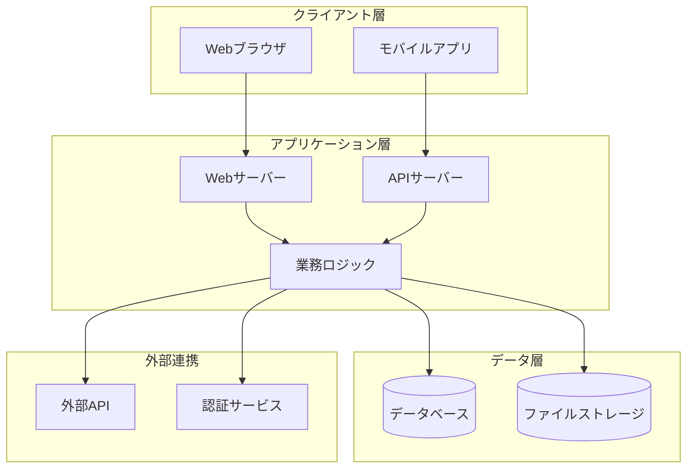
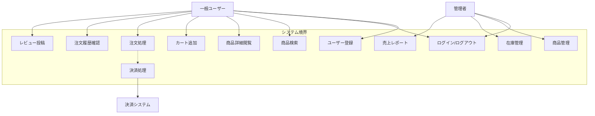
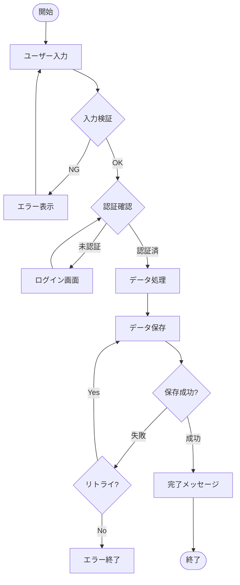
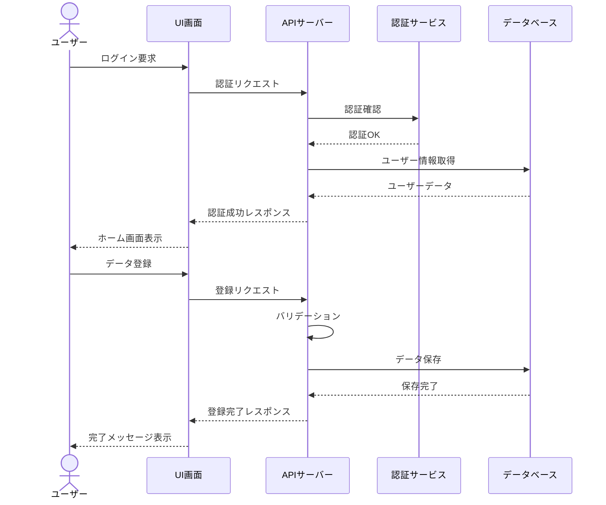
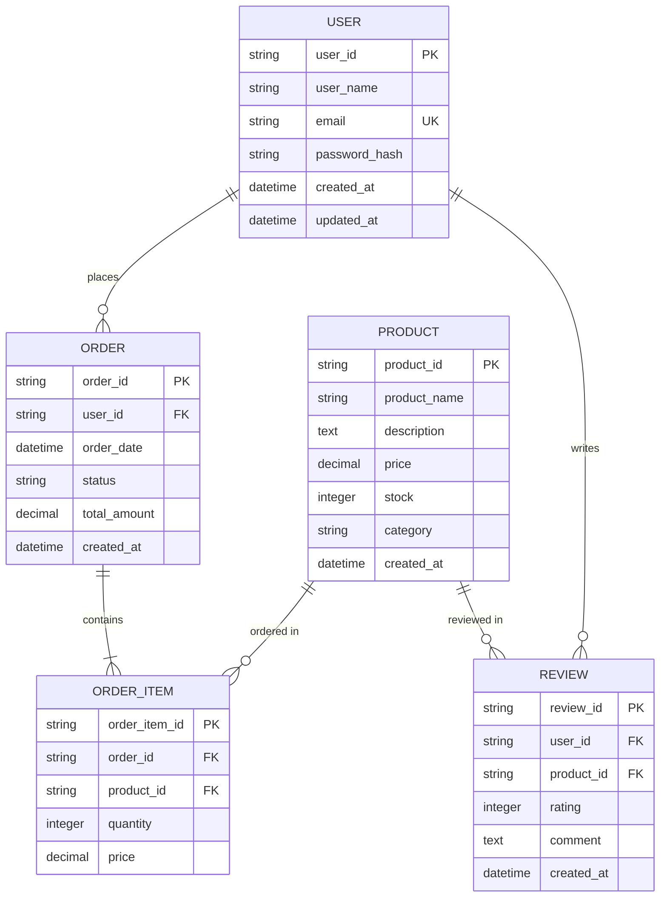
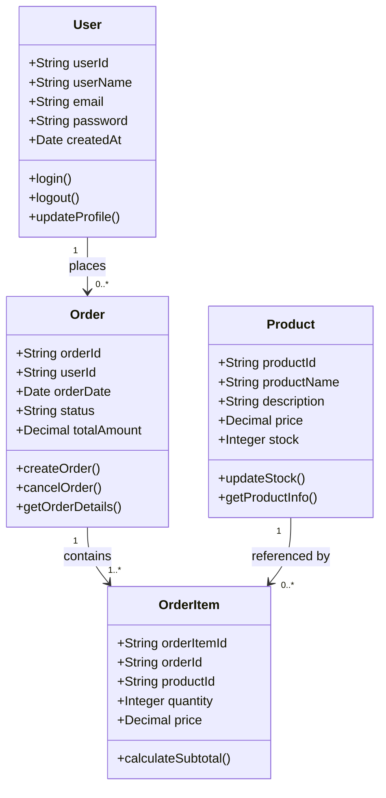
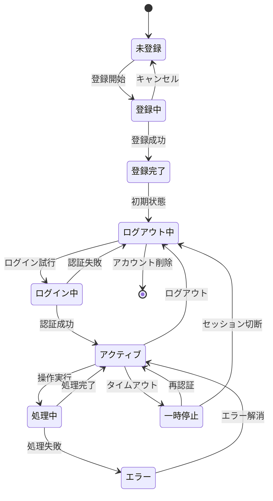
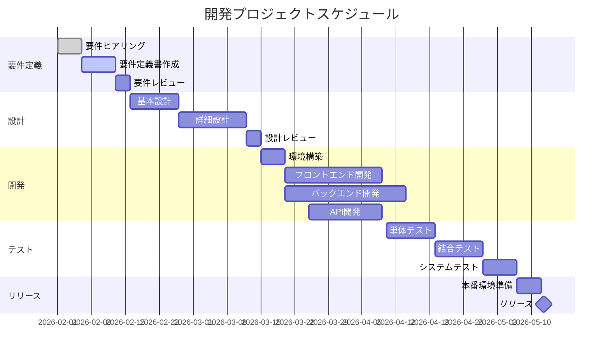

# システム要件定義書

**作成日:** 2026年2月16日  
**バージョン:** 1.0  
**作成者:** [林]

##  システム概要

本システムは、[従来の防犯ブザーでは防げない脅威を防ぐ]を実現するためのシステムです。

---

##  システム構成

###  システムアーキテクチャ

システムは3層アーキテクチャで構成され、クライアント層、アプリケーション層、データ層に分離されています。

---

## 機能要件

本システムが提供する機能の全体像を定義します。機能要件は、システムが「何をすべきか」を示す最も重要な要素であり、ビジネス要求を技術的に実現可能な形で表現したものです。

本セクションでは、ユーザーの役割（一般ユーザー、管理者）ごとに利用可能な機能を明確化し、外部システムとの連携も含めて整理しています。各機能は独立性を保ちながらも相互に連携し、シームレスなユーザー体験を提供できるよう設計されています。

### 機能一覧（ユースケース）

**一般ユーザー機能：**
一般ユーザーは商品の検索・閲覧から注文・決済までの一連のEコマース機能を利用できます。具体的には、ユーザー登録によりアカウントを作成し、ログイン認証後に商品検索機能で目的の商品を探し、商品詳細画面で仕様や価格を確認します。購入したい商品はショッピングカートに追加でき、複数商品をまとめて注文処理に進むことができます。注文確定後は外部決済システムと連携して安全な決済処理を実行し、注文履歴から過去の購入記録を確認できます。また、購入した商品に対してレビューを投稿し、品質評価や使用感を共有することも可能です。

**管理者機能：**
管理者は商品管理や在庫管理、売上レポートなどのバックオフィス機能にアクセスできます。商品管理機能では、新規商品の登録、既存商品の情報更新、商品の削除を行い、商品カタログを最新の状態に保ちます。在庫管理機能では、各商品の在庫数をリアルタイムで監視し、在庫切れや過剰在庫を防ぐための調整を行います。売上レポート機能では、日次・月次・年次の売上データを可視化し、ビジネスインサイトを得るための分析資料として活用できます。

**外部システム連携：**
決済処理については、セキュリティとPCI DSS準拠の観点から、専門の外部決済システムと連携して実現します。これにより、クレジットカード情報などの機密データを自社システムで保持することなく、安全な決済処理を提供できます。

### 処理フロー

標準的な業務処理の流れを詳細に示します。本フローは、システム全体で共通的に適用される処理パターンのテンプレートとして機能します。

**入力フェーズ：**
ユーザーからの入力を受け付け、クライアントサイドでの初期チェックを実施します。必須項目の入力確認や形式チェックをJavaScriptで行い、明らかな不備は即座にフィードバックします。

**検証フェーズ：**
入力データのバリデーションを実行します。データ型、文字列長、数値範囲、日付形式、メールアドレス形式など、ビジネスルールに基づいた詳細な検証を行います。検証エラーが発生した場合は、具体的なエラーメッセージをユーザーに表示し、再入力を促します。検証に合格したデータのみが次の処理に進みます。

**認証フェーズ：**
ユーザーの認証状態を確認します。未認証の場合はログイン画面にリダイレクトし、認証情報（ユーザーID、パスワード）の入力を要求します。認証が成功すると、セッションまたはJWTトークンを発行し、ユーザーの識別情報を保持します。認証済みユーザーのみが保護されたリソースにアクセスできます。

**処理フェーズ：**
認証が確認されたら、ビジネスロジックに基づいたデータ処理を実行します。必要に応じて外部APIとの連携、複雑な計算処理、データ変換などを行います。処理結果はトランザクション管理のもと、データベースに保存されます。

**保存フェーズとエラーハンドリング：**
データベースへの保存を試みます。保存が成功した場合は完了メッセージを表示し、処理を正常終了します。保存が失敗した場合は、リトライロジックが作動し、ユーザーに再試行の意思を確認します。再試行を選択した場合は保存処理を再実行し、諦める場合はエラー状態で終了します。すべての処理はログに記録され、トレーサビリティを確保しています。

---

## システム連携

本システムを構成する各コンポーネント間の相互作用を時系列で詳細に示します。分散システムアーキテクチャにおいて、各コンポーネントがどのように協調して動作するかを理解することは、システムの信頼性とパフォーマンスを確保する上で極めて重要です。

ユーザーからのリクエストが、UI層、API層、認証層、データ層をどのように経由して処理され、最終的にユーザーに結果が返されるまでの一連のプロセスを詳細に記述しています。各コンポーネント間の通信プロトコル（HTTP/HTTPS、REST API）、データフォーマット（JSON）、認証方式（JWT）なども考慮されています。

### シーケンス図

**ログインシナリオ：**
ユーザーがログイン画面で認証情報（ユーザーID、パスワード）を入力すると、UIコンポーネントはその情報をAPIサーバーに送信します。APIサーバーは受け取った認証情報を外部の認証サービス（例：Auth0、Firebase Authentication、独自の認証サーバー）に転送し、認証の妥当性を検証します。認証サービスは、パスワードのハッシュ値比較、アカウントのロック状態確認、多要素認証（MFA）の検証などを行い、結果をAPIサーバーに返します。

認証が成功した場合、APIサーバーはデータベースからユーザーの詳細情報（プロフィール、権限、設定など）を取得します。この情報を含めたレスポンスをUIに返し、UIはユーザーをホーム画面にリダイレクトします。同時に、セッションの確立またはJWTトークンの発行が行われ、以降のリクエストでユーザーを識別できるようにします。

**データ登録シナリオ：**
ログイン済みのユーザーがデータ登録操作を行うと、UIはフォームのデータを収集し、APIサーバーにPOSTリクエストを送信します。APIサーバーはまず認証トークンの検証を行い、ユーザーの正当性を確認します。次に、ビジネスルールに基づいたバリデーション（入力値チェック、権限確認、重複チェックなど）を実行します。

バリデーションに合格したデータは、トランザクション制御のもとでデータベースに保存されます。データベースは保存完了を示すレスポンスをAPIサーバーに返し、APIサーバーはそれをUIに転送します。UIは最終的にユーザーに成功メッセージを表示し、必要に応じて画面の更新や次の画面への遷移を行います。

**エラーハンドリング：**
各ステップでエラーが発生した場合（ネットワークエラー、タイムアウト、バリデーションエラー、データベースエラーなど）、適切なエラーレスポンスが返され、ユーザーに分かりやすいメッセージが表示されます。エラーログは集中管理され、運用チームが迅速に問題を特定・対応できるようになっています。

---

## 5. データベース設計

システムで扱うデータの構造と、テーブル間の関係性を詳細に定義します。データベース設計は、システムのパフォーマンス、スケーラビリティ、保守性に直接影響する重要な要素です。

本設計では、第三正規形（3NF）に基づいた正規化を適用し、データの冗長性を最小限に抑えながら、データの整合性と一貫性を保証します。同時に、頻繁にアクセスされるデータに対しては適切な非正規化やキャッシング戦略を採用し、読み取りパフォーマンスを最適化します。

### ER図

**USER（ユーザー）テーブル：**
システムを利用するユーザーの基本情報を格納します。user_idを主キー（UUID形式）とし、user_name（表示名）、email（ログインIDとしても使用、ユニーク制約付き）、password_hash（bcryptでハッシュ化されたパスワード）、created_at（アカウント作成日時）、updated_at（最終更新日時）を保持します。セキュリティ上、平文パスワードは保存せず、必ずハッシュ化した値のみを格納します。emailには一意制約（UNIQUE）が設定され、重複登録を防止します。

**ORDER（注文）テーブル：**
顧客からの注文情報を管理します。order_idを主キーとし、user_id（外部キー、USERテーブルへの参照）、order_date（注文日時）、status（注文状態：pending/processing/shipped/delivered/cancelled）、total_amount（合計金額）、created_at（レコード作成日時）を保持します。1人のユーザーは複数の注文を持つことができる（1対多の関係）ため、user_idに対してインデックスを設定し、検索パフォーマンスを向上させます。

**PRODUCT（商品）テーブル：**
Eコマースで販売する商品のマスターデータを格納します。product_idを主キーとし、product_name（商品名）、description（商品説明、テキスト型で長文対応）、price（販売価格、DECIMAL型で正確な金額表現）、stock（在庫数、INTEGER型）、category（商品カテゴリー）、created_at（登録日時）を保持します。在庫数は注文が確定するたびに減算され、リアルタイムで更新されます。priceはDECIMAL型を使用し、浮動小数点数の誤差を排除します。

**ORDER_ITEM（注文明細）テーブル：**
注文と商品の多対多の関係を解消するための中間テーブルです。order_item_idを主キーとし、order_id（外部キー、ORDERテーブルへの参照）、product_id（外部キー、PRODUCTテーブルへの参照）、quantity（注文数量）、price（注文時点の商品単価、価格変動に対応するため商品テーブルとは別に保存）を保持します。1つの注文は複数の商品明細を持ち（1対多）、1つの商品は複数の注文明細で参照されます（1対多）。これにより、「注文Aには商品Xが2個、商品Yが1個含まれる」といった複雑な関係を表現できます。

**REVIEW（レビュー）テーブル：**
ユーザーが商品に対して投稿するレビューを格納します。review_idを主キーとし、user_id（外部キー、投稿者）、product_id（外部キー、評価対象商品）、rating（評価点、1～5の整数）、comment（コメント本文、テキスト型）、created_at（投稿日時）を保持します。1人のユーザーは複数のレビューを書くことができ（1対多）、1つの商品は複数のレビューを持つことができます（1対多）。user_idとproduct_idの複合キーに対してユニーク制約を設定することで、同じユーザーが同じ商品に対して複数回レビューを投稿できないように制御することも可能です。

**データ整合性とパフォーマンス：**
すべての外部キーには参照整合性制約（FOREIGN KEY CONSTRAINT）が設定され、孤立したレコードの発生を防ぎます。頻繁に使用される検索条件（user_idによるORDER検索、product_idによるREVIEW検索など）にはインデックスを設定し、クエリのパフォーマンスを最適化します。また、created_atフィールドには自動的に現在日時が設定されるデフォルト値（CURRENT_TIMESTAMP）を指定し、データの追跡可能性を確保します。

---

##  オブジェクト設計

オブジェクト指向設計の原則（SOLID原則）に基づき、システムを構成するクラスとその関係性を詳細に定義します。適切なオブジェクト設計により、コードの再利用性、テスタビリティ、保守性が向上し、長期的な開発コストを削減できます。

各クラスは単一責任の原則（Single Responsibility Principle）に従い、明確に定義された1つの責任のみを持ちます。カプセル化により内部実装を隠蔽し、外部からは公開されたインターフェース（メソッド）のみを通じてアクセスできるようにします。これにより、内部実装の変更が外部のコードに影響を与えないようにし、変更容易性を確保します。

### クラス図

**Userクラス（ユーザー管理）：**
システムのユーザーを表現するエンティティクラスです。属性として、userId（ユーザーの一意識別子）、userName（表示名）、email（メールアドレス）、password（パスワード、実際にはハッシュ化された状態で保持）、createdAt（アカウント作成日時）を持ちます。

メソッドとして、login()（ログイン処理、認証情報の検証とセッション確立）、logout()（ログアウト処理、セッションの破棄）、updateProfile()（プロフィール情報の更新）を提供します。これらのメソッドはユーザーのライフサイクル全体を管理し、認証・認可に関するビジネスロジックをカプセル化します。

**Orderクラス（注文管理）：**
顧客の注文を表現するエンティティクラスです。属性として、orderId（注文の一意識別子）、userId（注文者のユーザーID）、orderDate（注文日時）、status（注文状態：pending/processing/shipped/delivered/cancelled）、totalAmount（合計金額）を持ちます。

メソッドとして、createOrder()（新規注文の作成、在庫確認と在庫数の減算を含む）、cancelOrder()（注文のキャンセル、在庫の復元処理を含む）、getOrderDetails()（注文の詳細情報取得、関連する注文明細を含む）を提供します。createOrder()メソッドは複雑なビジネスロジックを含み、在庫チェック、価格計算、トランザクション管理などを統合的に処理します。

**Productクラス（商品管理）：**
Eコマースの商品を表現するエンティティクラスです。属性として、productId（商品の一意識別子）、productName（商品名）、description（商品説明）、price（販売価格）、stock（在庫数）を持ちます。

メソッドとして、updateStock()（在庫数の更新、注文時の減算や入荷時の加算）、getProductInfo()（商品情報の取得、関連するレビューや評価の集計を含む）を提供します。updateStock()メソッドは在庫管理の中核であり、在庫切れチェックや在庫警告の発行などの機能も含みます。

**OrderItemクラス（注文明細管理）：**
注文と商品の関連を表現する関連クラスです。属性として、orderItemId（明細の一意識別子）、orderId（所属する注文のID）、productId（参照する商品のID）、quantity（注文数量）、price（注文時点の商品単価）を持ちます。

メソッドとして、calculateSubtotal()（小計の計算、quantity × priceを返す）を提供します。このクラスは注文と商品の多対多の関係を解決し、「どの注文にどの商品が何個含まれるか」という情報を保持します。

**クラス間の関係性：**
- Userクラスと Orderクラスは1対多の関連（1人のユーザーは0個以上の注文を持つ）
- Orderクラスと OrderItemクラスは1対多の関連（1つの注文は1個以上の注文明細を必ず持つ）
- Productクラスと OrderItemクラスは1対多の関連（1つの商品は0個以上の注文明細で参照される）

これらの関連は多重度で明示され、ビジネスルール（例：注文には少なくとも1つの商品が必要）を設計レベルで表現しています。また、依存性注入（Dependency Injection）パターンを適用することで、クラス間の結合度を低く保ち、テストの容易性とモジュールの交換可能性を確保します。

---

## 状態管理

ユーザーやシステムの状態がどのように変化するかを厳密に定義します。状態遷移図は、有限状態機械（Finite State Machine, FSM）の理論に基づいており、各状態間の遷移条件とトリガーイベントを明確にすることで、予期しない状態やデッドロック状態の発生を防止します。

適切な状態管理により、システムの振る舞いが予測可能になり、デバッグが容易になります。また、状態ごとに許可される操作を制限することで、セキュリティとデータ整合性を確保します。

### 状態遷移図

ユーザーのライフサイクル全体を詳細に表現しています。以下、各状態とその遷移条件を説明します。

**初期状態から登録まで：**
システムの初期状態である「未登録」状態では、ユーザーはアカウントを持っていません。ユーザーが「登録開始」イベントをトリガーすると、「登録中」状態に遷移します。この状態では、ユーザー情報（メールアドレス、パスワード、表示名など）の入力フォームが表示され、バリデーションが実行されます。「登録成功」イベント（すべてのバリデーションに合格し、データベースへの登録が完了）により「登録完了」状態に遷移します。一方、ユーザーが登録プロセスを中断した場合、「キャンセル」イベントにより「未登録」状態に戻ります。

**ログイン・ログアウトサイクル：**
「登録完了」状態のユーザーは、初期状態として「ログアウト中」に設定されます。ユーザーが認証情報を入力して「ログイン試行」イベントをトリガーすると、「ログイン中」状態に遷移します。この状態では、認証サービスが認証情報の妥当性を検証します。認証が失敗した場合（パスワード不一致、アカウントロックなど）、「認証失敗」イベントにより「ログアウト中」状態に戻り、エラーメッセージが表示されます。認証が成功すると、「認証成功」イベントにより「アクティブ」状態に遷移し、ユーザーはシステムのすべての機能にアクセスできるようになります。

**アクティブ状態での操作：**
「アクティブ」状態では、ユーザーはデータの閲覧、作成、更新、削除などの操作を実行できます。「操作実行」イベントにより「処理中」状態に遷移し、バックエンドでの処理が実行されます。処理が正常に完了すると「処理完了」イベントにより「アクティブ」状態に戻ります。処理中にエラーが発生すると（ネットワークエラー、バリデーションエラー、データベースエラーなど）、「処理失敗」イベントにより「エラー」状態に遷移します。

**エラーハンドリング：**
「エラー」状態では、エラーメッセージが表示され、ユーザーに対処方法（再試行、キャンセルなど）が提示されます。エラーが解消されると（再試行成功、ユーザーによる修正など）、「エラー解消」イベントにより「アクティブ」状態に戻ります。

**セッション管理と一時停止：**
ユーザーがシステムを一定時間操作しない場合、「タイムアウト」イベントにより「一時停止」状態に遷移します。この状態では、セキュリティ上の理由からセッションが部分的に無効化されます。ユーザーが操作を再開すると、「再認証」イベントがトリガーされ、パスワードの再入力などの簡易認証が求められます。再認証に成功すると「アクティブ」状態に復帰します。セッションの有効期限が完全に切れた場合、「セッション切断」イベントにより「ログアウト中」状態に遷移し、完全な再ログインが必要になります。

**ログアウトとアカウント削除：**
ユーザーが明示的にログアウトを選択すると、「ログアウト」イベントにより「アクティブ」状態から「ログアウト中」状態に遷移します。この際、セッション情報やトークンは破棄されます。ユーザーがアカウント削除を選択すると、「ログアウト中」状態から「アカウント削除」イベントがトリガーされ、最終状態（終了状態）に遷移します。この状態では、ユーザーのアカウントデータが完全に削除され（またはGDPR準拠のため論理削除され）、システムから退出します。

**状態不変条件とガード条件：**
各状態には不変条件（invariant）が定義されており、例えば「アクティブ」状態では必ず有効なセッションまたはトークンが存在する、といった制約が保証されます。また、状態遷移にはガード条件が設定され、特定の条件を満たした場合のみ遷移が許可されます（例：「ログイン試行」→「アクティブ」遷移は、認証が成功した場合のみ発生）。これにより、システムの整合性と予測可能性が確保されます。

---

## プロジェクトスケジュール

## 変更履歴

| バージョン | 日付 | 変更内容 | 作成者 |
|---------|------|---------|--------|
| 1.0 | 2026-02-16 | 初版作成 | [林] |

---

## 12. 承認

| 役割 | 氏名 | 承認日 | 署名 |
|-----|------|--------|------|
| プロジェクトマネージャー | | | |
| システムアーキテクト | | | |
| 顧客代表 | | | |

---

